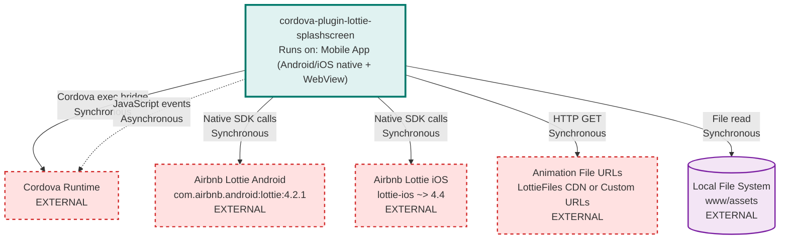

# cordova-plugin-lottie-splashscreen Architecture

> **Repository:** cordova-plugin-lottie-splashscreen
> **Runtime Environment:** Mobile Application (Android & iOS native + Cordova WebView)
> **Last Updated:** 2026-03-20

## Overview

This repository implements a Cordova plugin that replaces the standard splash screen with animated Lottie splash screens on Android and iOS platforms. The plugin bridges JavaScript API calls from the Cordova WebView to native implementations that render Lottie animations using Airbnb's Lottie libraries.

## Architecture Diagram

## External Integrations

| External Service | Communication Type | Purpose |
|------------------|-------------------|---------|
| Cordova Runtime | Sync (exec bridge) / Async (events) | Bidirectional bridge between JavaScript and native code |
| Airbnb Lottie Android | Sync (SDK calls) | Render Lottie animations on Android using LottieAnimationView |
| Airbnb Lottie iOS | Sync (SDK calls) | Render Lottie animations on iOS using LottieAnimationView |
| Remote Animation URLs | Sync (HTTP GET) | Download Lottie JSON animation files when LottieRemoteEnabled is true |
| Local File System | Sync (File read) | Load bundled Lottie JSON/ZIP files from app assets |

## Architectural Tenets

### T1. Bidirectional Event-Driven Bridge Pattern

The plugin implements a bidirectional communication pattern where JavaScript calls native methods synchronously via Cordova's exec bridge, while native code communicates back to JavaScript asynchronously via DOM events dispatched to the WebView.

**Evidence:**
- `www/lottie-splashscreen.ts` (in `hide` and `show` methods) - uses Cordova exec to call native methods and returns Promises
- `src/android/LottieSplashScreen.kt` (in `addAnimationListeners`) - dispatches JavaScript events via evaluateJavascript for animation lifecycle
- `src/ios/LottieSplashScreen.swift` (in `playAnimation`) - dispatches events to document using evaluateJavaScript
- `www/lottie-splashscreen.ts` (in static initialization) - listens to Lottie events via document.addEventListener

### T2. Platform-Specific Configuration with Fallback Hierarchy

Configuration values follow a three-tier hierarchy: dark mode preferences override light mode preferences, which override base preferences. This pattern ensures graceful degradation when platform-specific values are not provided.

**Evidence:**
- `src/android/LottieSplashScreen.kt` (in `getUIModeDependentPreference`) - checks Dark/Light suffixed preferences before falling back to base preference
- `src/ios/LottieSplashScreen.swift` (in `getUIModeDependentPreference`) - implements identical fallback logic for iOS
- `example/config.xml` - demonstrates separate LottieAnimationLocationLight, LottieAnimationLocationDark, and LottieBackgroundColor preferences

### T3. Synchronous Guard Against Concurrent Animations

The plugin prevents multiple simultaneous animations by maintaining state flags and throwing exceptions when attempting to show an animation while one is already playing. This enforces single animation instance at runtime.

**Evidence:**
- `src/android/LottieSplashScreen.kt` (in `createView`) - checks if splashDialog is initialized and showing, throws LottieSplashScreenAnimationAlreadyPlayingException
- `src/ios/LottieSplashScreen.swift` (in `createView`) - checks visible flag and returns error via callback if animation already playing
- `src/android/LottieSplashScreenExceptions.kt` - defines custom exception types for plugin-specific error conditions
- `www/lottie-splashscreen.ts` - tracks animationEnded state flag to coordinate with native state

### T4. Platform-Specific Native Implementation with Unified JavaScript Interface

Native implementations are completely independent for Android (Kotlin) and iOS (Swift), with no shared code beyond the plugin configuration. The JavaScript layer provides a unified API that abstracts platform differences.

**Evidence:**
- `src/android/` - contains Kotlin implementation with Android-specific classes like Dialog, ImageView.ScaleType
- `src/ios/` - contains Swift implementation with iOS-specific classes like UIView, UITapGestureRecognizer
- `www/lottie-splashscreen.ts` - single TypeScript class exposes uniform API regardless of platform
- `plugin.xml` - declares separate platform blocks with distinct native dependencies (AndroidX vs CocoaPods)

### T5. Preference-Driven Configuration Over Programmatic Defaults

Plugin behavior is primarily controlled through Cordova preferences in config.xml rather than hardcoded defaults in native code. This enables build-time configuration without code changes while supporting runtime overrides via JavaScript API.

**Evidence:**
- `src/android/LottieSplashScreen.kt` (in `configureAnimationView` and throughout) - reads preferences for every configurable behavior
- `src/ios/LottieSplashScreen.swift` (throughout) - accesses commandDelegate.settings for all configuration values
- `plugin.xml` - documents preference structure via platform-specific configuration
- `www/lottie-splashscreen.ts` (in `show` method) - accepts optional parameters that override config.xml preferences at runtime
